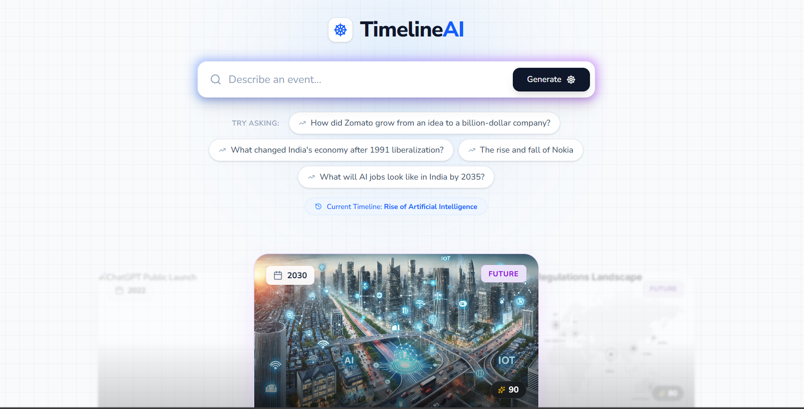
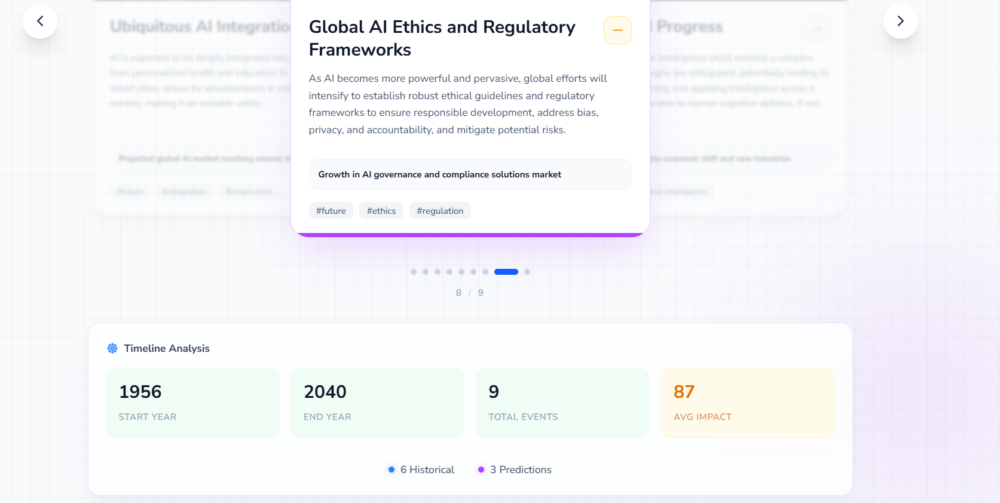

# 🚀 TimelineAI

**TimelineAI** is a generative UI intelligent timeline generator that transforms any topic, person, company, or event into a stunning visual journey through time. 
Powered by Google's Gemini AI and real-time image search, it creates comprehensive timelines that blend historical facts with AI-predicted future outcomes—all 
presented in a beautiful, interactive carousel interface.

[](https://timeline-seedhecode.vercel.app/)
[](LICENSE)
[](https://vercel.com)
[](https://coderabbit.ai)

---

## 📋 Table of Contents

- [Features](#-features)
- [Demo](#-demo)
- [Tech Stack](#-tech-stack)
- [Getting Started](#-getting-started)
  - [Prerequisites](#prerequisites)
  - [Local Development](#local-development)
  - [Environment Variables](#environment-variables)
- [Project Structure](#-project-structure)
- [API Documentation](#-api-documentation)
- [Code Quality](#-code-quality-with-coderabbit)
- [Contributing](#-contributing)
- [Sponsors](#-sponsors)
- [License](#-license)
- [Contact](#-contact)
- [Acknowledgments](#-acknowledgments)

---

## ✨ Features



### Core Capabilities
- 🤖 **AI-Powered Timeline Generation** - Uses Google Gemini 2.5 Flash to analyze topics and generate comprehensive timelines
- 🔮 **Future Predictions** - Not just history—predicts future milestones based on current trends and patterns
- 🖼️ **Contextual Images** - Automatically fetches relevant images using Tavily Search API for each timeline event
- 🎨 **Beautiful 3D Carousel UI** - Interactive card-based interface with smooth animations and gradient effects
- ⚡ **Real-time Streaming** - Server-Sent Events (SSE) for progressive timeline generation with live status updates
- 🎯 **Intent Classification** - Intelligently routes between timeline generation and general chat responses

### Event Metadata
- **Rich Event Data** - Year, title, description, sentiment analysis, impact scoring (0-100)
- **Market Insights** - Optional market value and financial data for business-related timelines
- **Smart Tagging** - Auto-generated categorized tags for each milestone
- **Visual Indicators** - Sentiment icons, event type badges, and impact score displays

### User Experience
- 📱 **Responsive Design** - Works seamlessly on desktop, tablet, and mobile devices
- 🔄 **Auto-play Carousel** - Automated progression through timeline events
- ⌨️ **Keyboard Navigation** - Arrow keys for quick timeline browsing
- 💾 **Example Prompts** - Pre-built queries to help users get started quickly
- 🎭 **Dual Mode Operation** - Timeline mode for historical analysis, chat mode for Q&A

---

## 🎬 Demo

- **Live Application:** [https://timeline-seedhecode.vercel.app/](https://timeline-seedhecode.vercel.app/)
- **Backend API:** [https://gen-ui-9ux9.onrender.com](https://gen-ui-9ux9.onrender.com)
- **Health Check:** [https://gen-ui-9ux9.onrender.com/health](https://gen-ui-9ux9.onrender.com/health)

### Example Queries
- "Show me the rise and fall of Nokia"
- "How did Virat Kohli become what he is today?"
- "How did Zomato grow from an idea to a billion-dollar company?"
- "What changed India's economy after 1991 liberalization?"
- "What will AI jobs look like in India by 2035?"

---

## 🛠️ Tech Stack

### Frontend
- **Framework:** React 18 + TypeScript
- **Build Tool:** Vite (Fast HMR and optimized builds)
- **Styling:** TailwindCSS (Utility-first CSS framework)
- **UI Components:** Custom 3D carousel with CSS animations
- **State Management:** React Hooks (useState, useRef, useEffect)
- **API Communication:** EventSource API for Server-Sent Events (SSE)
- **Font:** Nunito Sans (Google Fonts)

### Backend
- **Runtime:** Bun (Fast JavaScript runtime) / Node.js compatible
- **Framework:** Express.js (Web application framework)
- **Language:** TypeScript (Type-safe development)
- **AI/LLM:** Google Gemini 2.5 Flash via LangChain
- **Search API:** Tavily API (Contextual image retrieval)
- **Validation:** Zod (TypeScript-first schema validation)
- **Streaming:** Server-Sent Events (SSE) for real-time updates

### AI & APIs
- **LangChain:** [@langchain/google-genai](https://www.npmjs.com/package/@langchain/google-genai) - Google Gemini integration
- **Gemini Model:** gemini-2.5-flash (fast inference)
- **Image Search:** [Tavily API](https://tavily.com) - AI-powered search with image results
- **Structured Output:** Zod schemas for type-safe LLM responses

### Deployment & DevOps
- **Frontend Hosting:** Vercel (Serverless deployment)
- **Backend Hosting:** Render (Container-based deployment)
- **Version Control:** Git & GitHub
- **Code Quality:** CodeRabbit (Automated PR reviews)


---

## 🚀 Getting Started

### Prerequisites

Ensure you have the following installed:

- **Node.js** (v18 or higher) - [Download](https://nodejs.org/)
- **Bun** (v1.0+) - [Install](https://bun.sh/) or use npm/yarn
- **Git** - [Download](https://git-scm.com/)
- **API Keys:**
  - Google Gemini API key - [Get here](https://makersuite.google.com/app/apikey)
  - Tavily API key - [Get here](https://tavily.com/)

### Local Development

#### 1. Clone the Repository
```bash
git clone https://github.com/s-mahali/TimelineAI.git
cd GEN_UI
```

#### 2. Backend Setup
```bash
cd backend

# Install dependencies
bun install
# or
npm install

# Create environment file
cp .env.example .env

# Edit .env and add your API keys
# GEMINI_API_KEY=your_gemini_key_here
# TAVILY_API_KEY=your_tavily_key_here

# Run development server
bun run dev
# or
npm run dev
```

Backend will start on `http://localhost:5000`

#### 3. Frontend Setup
```bash
cd ../client

# Install dependencies
pnpm install

# Run development server
pnpm run dev

```

Frontend will start on `http://localhost:5173`

#### 4. Test the Application

Open your browser and navigate to:
- **Frontend:** http://localhost:5173
- **Backend Health:** http://localhost:5000/health

Try example queries like "Show me the rise and fall of Nokia"

### Environment Variables
---

## 📁 Project Structure

```
GEN_UI/
├── backend/
│   ├── src/
│   │   ├── index.ts          # LLM logic, timeline generation, intent classification
│   │   └── server.ts         # Express server, routes, CORS, SSE endpoints
│   ├── .coderabbit.yaml      # CodeRabbit configuration
│   ├── package.json
│   ├── tsconfig.json
│   
│
├── client/
│   ├── src/
│   │   ├── Component/
│   │   │   ├── TimelineCard.tsx   #TimelineCard 
│   │   │   ├── TimelineCarousel.tsx # 3D carousel component
│   │   │   └── Footer.tsx          # Statistics footer
│   │   
│   │   │   
│   │   ├── App.tsx                 # Main application logic
│   │   ├── index.css               # Global styles + TailwindCSS
│   │   └── main.tsx                # React entry point
│   ├── public/
│   ├── package.json
│   └── vite.config.ts
│
├── README.md


```

---

## 📡 API Documentation

### Endpoints

#### 1. **Health Check**
```http
GET /health
```

**Response:**
```json
{
  "message": "OK",
  "date": "12/14/2024"
}
```

#### 2. **Generate Timeline (POST)**
```http
POST /chat
Content-Type: application/json

{
  "query": "Show me the rise and fall of Nokia"
}
```

**Response:**
```json
{
  "success": true,
  "type": "timeline",
  "message": "✅ generated timeline successfully",
  "payload": {
    "type": "timeline",
    "data": {
      "entity": "Nokia",
      "events": [
        {
          "id": "1",
          "year": 1998,
          "title": "Nokia becomes world's largest mobile phone manufacturer",
          "description": "...",
          "type": "historical",
          "sentiment": "positive",
          "impactScore": 95,
          "marketValue": "$150B",
          "tags": ["mobile", "leadership", "growth"],
          "imageUrl": "https://..."
        }
      ]
    }
  }
}
```

#### 3. **Stream Timeline (SSE)**
```http
GET /chat/stream?query=Show me the rise and fall of Nokia
```

**Event Stream:**
```
data: {"type":"start","message":"Analyzing your query..."}

data: {"type":"intent","data":{"intent":"timeline","entity":"Nokia"}}

data: {"type":"timeline","message":"Generating timeline events..."}

data: {"type":"image","message":"Fetching image 1/8..."}

data: {"type":"event","data":{...event_data...}}

data: {"type":"done"}
```

---

## 🤖 Code Quality with CodeRabbit

TimelineAI maintains high code quality standards through automated CodeRabbit reviews:

- ✅ **Custom Configuration** - [`.coderabbit.yaml`](backend/.coderabbit.yaml) with project-specific rules
- ✅ **Automated PR Reviews** - Every pull request analyzed for quality issues
- ✅ **Focus Areas** - LLM integration, API security, async operations, TypeScript best practices
- ✅ **Continuous Improvement** - Real-time feedback on commits and PRs
- 🏆 **Captain Code Award Submission** - Demonstrating open-source excellence

### CodeRabbit Configuration

Our [`.coderabbit.yaml`](backend/.coderabbit.yaml) focuses on:
- Environment variable validation
- CORS configuration security
- TypeScript type safety
- Async/await error handling
- Memory leak prevention
- API endpoint structure
- SSE streaming implementation

**Key Improvements Identified by CodeRabbit:**
- ✅ CORS configuration fixes for production deployment
- ✅ Environment variable validation at startup
- ✅ Async error handling in SSE streams
- ✅ TypeScript type safety enhancements
- ✅ Line ending normalization (CRLF → LF)

---


## 🤝 Contributing

Contributions, bug reports, and feature requests are welcome!

### How to Contribute

1. **Fork the repository**
2. **Create a feature branch:**
   ```bash
   git checkout -b feature/my-amazing-feature
   ```
3. **Make your changes** and add tests where applicable
4. **Commit with clear messages:**
   ```bash
   git commit -m "feat: add timeline export feature"
   ```
5. **Push to your fork:**
   ```bash
   git push origin feature/my-amazing-feature
   ```
6. **Open a Pull Request** with a clear description of your changes

### Development Guidelines

- Follow existing code style (TypeScript, ESLint rules)
- Add comments for complex logic
- Update documentation for new features
- Test thoroughly before submitting PR
- CodeRabbit will automatically review your PR

---

## 🏆 Sponsors

A big thank you to our Agent Assemble Hackathon sponsors who made this project possible:

### 🤖 CodeRabbit
Providing automated AI-powered code reviews to improve code quality, catch bugs early, and maintain best practices throughout development.

### ⚡ Vercel
Providing deployment and preview platform support for seamless hosting, CI/CD, and global edge network delivery.

### 🎯 Hackathon Awards

**Applying for:**
- 🌩️ **Stormbreaker Deployment Award ($2,000)** - Deployed on Vercel
- 👨‍✈️ **Captain Code Award ($1,000)** - CodeRabbit integration for code quality

Their support helps make rapid prototyping and building at hackathons possible!

---

## 📄 License

This project is released under the **MIT License**. See [LICENSE](LICENSE) for details.

```
MIT License

Copyright (c) 2024 TimelineAI Contributors

Permission is hereby granted, free of charge, to any person obtaining a copy
of this software and associated documentation files (the "Software"), to deal
in the Software without restriction...
```

---

## 📧 Contact

**Maintainer:** [@s-mahali](https://github.com/s-mahali)  
**Contributors:** [@Viishal-62](https://github.com/Viishal-62)

### Links
- 🌐 **Live Demo:** [timeline-seedhecode.vercel.app](https://timeline-seedhecode.vercel.app/)
- 📦 **GitHub:** [github.com/s-mahali/TimelineAI](https://github.com/s-mahali/TimelineAI)
- 🐛 **Issues:** [Report bugs](https://github.com/s-mahali/TimelineAI/issues)
- 💡 **Discussions:** [Feature requests](https://github.com/s-mahali/TimelineAI/discussions)

For questions, partnership inquiries, or collaboration opportunities, please open an issue or reach out via GitHub.

---

## 🙏 Acknowledgments

- 🎓 **Wemakedevs Community** - For supporting creators and builders
- 🤖 **CodeRabbit** - For AI-powered code review and quality improvements
- ⚡ **Vercel** - For world-class deployment platform
- 🧠 **Google AI** - For Gemini API access and powerful LLM capabilities
- 🔍 **Tavily** - For intelligent search API with image results
- 🛠️ **LangChain** - For streamlined LLM integration framework
- 💎 **Open Source** - Built with inspiration from amazing open-source libraries

### Built With
- React + TypeScript
- TailwindCSS
- Express.js
- LangChain
- Google Gemini
- Tavily API

---

<div align="center">

**TimelineAI** - *Where history meets AI, and the future takes shape* ✨

Made with ❤️ for the Agent Assemble Hackathon

[⭐ Star us on GitHub](https://github.com/s-mahali/TimelineAI) | [🚀 Try Live Demo](https://timeline-seedhecode.vercel.app/)

</div>
